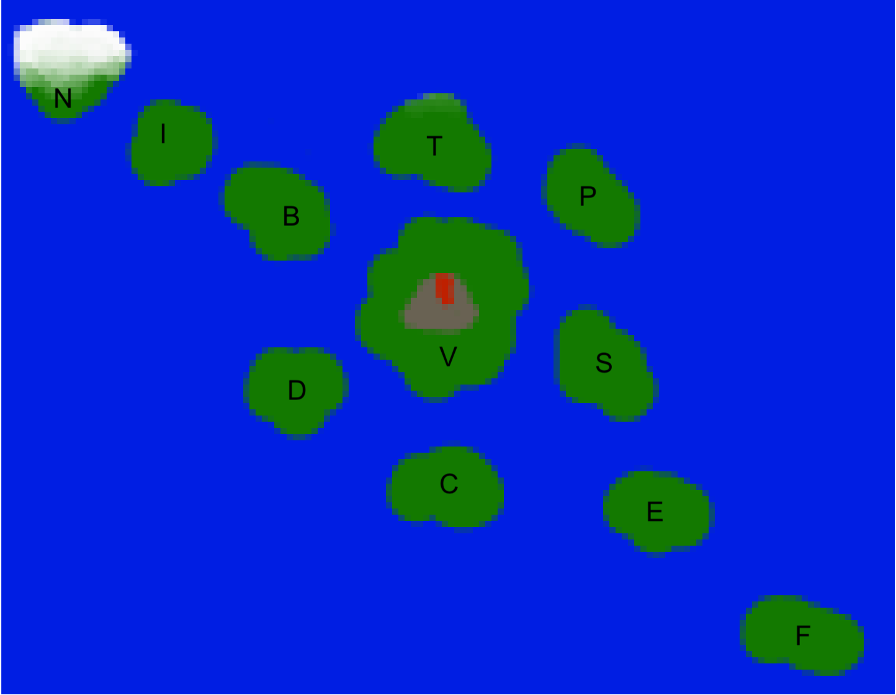

# Assignment 2

In this assignment you will implement f-Statistics and use them to learn about a fictional population history.  You will also use the [ADMIXTOOLS2](https://uqrmaie1.github.io/admixtools/) library, which has already implemented these methods to make these same analyses.

## Background

You have been given a map of the Fisher Islands (see below) with the names abbreviated by single letters



You have reached out to several archaeologists who have given you access to ancient Degnome skeletal remains from which you have acquired ancient DNA.  Thanks to the magical nature of Degnomes, the ancient data has the same high quality as the modern data.  The ancient DNA samples are labeled with their island of origin, and the carbon-dated years before present.  This data, which is a superset of the previous dataset of modern Degnomes [is now available](https://github.com/danieltabin/ADPGTPS/blob/main/datasets/modern_fisher_2026.zip).

There is fierce debate and many competing hypotheses among archaeologists about the history of the islands; however, most archaeologists agree that the first island settled from the neighboring continent of Wright-land was Faemoria, with the rest settled in a southeast to northwest pattern.  It also is relatively agreed upon that Faemoria has remained isolated since the islands were initially populated, with no gene flow between it and the rest of the islands.

You can and should use this knowledge in all parts of this homework

Free helpful functions.  Feel free to use these, or your own from last time

```{r}
if (!requireNamespace("devtools", quietly = TRUE)) {
  install.packages("devtools")
}
if (!requireNamespace("Rcpp", quietly = TRUE)) {
    install.packages("Rcpp")
}
if (!requireNamespace("tidyverse", quietly = TRUE)) {
    install.packages("tidyverse")
}
if (!requireNamespace("igraph", quietly = TRUE)) {
    install.packages("igraph")
}
if (!requireNamespace("plotly", quietly = TRUE)) {
    install.packages("plotly")
}

if (!requireNamespace("stringi", quietly = TRUE)) {
    install.packages("stringi")
}

library("devtools")
library("Rcpp")
library("tidyverse")
library("igraph")
library("plotly")
library("stringi")

devtools::install_github("uqrmaie1/admixtools"z)
library("admixtools")
```

```{r}
# load in the .geno file (this should return a matrix)
load_geno <- function(geno_file) {
    lines <- scan(geno_file, what = character());
    char_mat <- lapply(lines, function(x){ strsplit(x, split="")});
    flat_mat <- matrix(as.numeric(do.call(c, unlist(char_mat, recursive=FALSE))));
    
    total_vals <- length(flat_mat);
    num_inds <- str_length(lines[1]);
    num_snps <- total_vals/num_inds;
    
    mat <- matrix(unlist(flat_mat), ncol = num_inds, byrow=TRUE);
    return(mat);
}

# load in the .snp file (this should return a data frame)
load_snp <- function(snp_file) {
    snps <- data.table(fread(snp_file, header=FALSE));
    colnames(snps) <- c("SNP_Name", "Chromosome", "distance_(cM)", "BP", "Ref", "Alt");    
    return(snps);
}
# load in the .ind file (this should return a data frame)
load_ind <- function(ind_file) {
    inds <- data.table(fread(ind_file, header=FALSE));
    colnames(inds) <- c("Individual", "Sex", "Population"); 
    return(inds);
}

# write a function that runs all of the above functions at once
load_all <- function(prefix_name) {
    geno_name <- paste(prefix_name, ".geno", sep = "");
    snp_name <- paste(prefix_name, ".snp", sep = "");
    ind_name <- paste(prefix_name, ".ind", sep = "");
    
    geno_mat <- load_geno(geno_name);
    snp_df <- load_snp(snp_name);
    ind_df <- load_ind(ind_name);
    
    return(list(geno=geno_mat, snp=snp_df, ind=ind_df));
}
```

```{r}
# alternate, and likely faster, code

# NOTE, WHILE FINE FOR LOADING IN GENOS
# ***DO NOT*** USE EXISTING FUNCTIONS FROM
# ADMIXTOOLS FOR YOUR F-STAT COMPUTATIONS

load_geno <- function(geno_file) {
    G = read_eigenstrat(prefix_name)
    G$geno
}

# load in the .snp file (this should return a data frame)
load_snp <- function(snp_file) {
    G = read_eigenstrat(prefix_name)
    G$snp
}
# load in the .ind file (this should return a data frame)
load_ind <- function(ind_file) {
    G = read_eigenstrat(prefix_name)
    G$ind
}

# write a function that runs all of the above functions at once
load_all <- function(prefix_name) {
    G = read_eigenstrat(prefix_name)
}
```

```{r}
all_data  <- #your code here 
```

## Problem 1: $f_2$, $f_3$, and $f_4$ 

### Part A: Implement the three functions

Write functions, ```f_2```, ```f_3```, and ```f_4```, that calculate each respective f-Statistic.

As a reminder:
$$f_2(X;Y) = (x-y)(x-y)$$
$$f_3(X,Y;Z) = (x-z)(y-z)$$
$$f_4(X,Y;U,V) = (x-y)(u-v)$$

```{r}
# calculate f_2(pop1; pop2)
f_2 <- function(pop1_afs, pop2_afs) {
    # your code here
}

# calculate f_3(pop1, pop2; pop3)
f_3 <- function(pop1_afs, pop2_afs, pop3_afs) {
    # your code here
}

# calculate f_4(pop1, pop2; pop3, pop4)
f_4 <- function(pop1_afs, pop2_afs, pop3_afs, pop4_afs) {
    # your code here
}
```

### Part B: Using your functions

How far apart (in terms of branch length (aka $f_2$)) are Tomtetown and Piconye? How far are either of those in compared to Vulcan?

Which pair is the closest? Which is the most distant?

*Bonus: calculate $F_{ST}$ between these three pairs and comapre and contrast the results*

```{r}
# your code here
```

Your thoughts here

Using Faemoria as an outgroup, compute outgroup $f_3s$ on these same three pairs.  Does this give us the same information, or different information?  Explain your opinion.

Can you show strong evidence (in the form of an $f_3$ statistic) that any of the three previously discussed islands are admixed between the other two?

```{r}
# your code here
```

Your thoughts here

One archaeologist espouses the "single wave" theory of the Fischer islands.  This hypothesis states that only a single wave of population expansion took place with no subsequent admixture happening afterwards.  This archeologist claims that $f_4(F, E, I, N)\approxeq 0$ and uses that as evidence of their claim.

Are they right about the f-statistic?  Does this show that their claim correct?  Why or why not?

Find and compute an additional $f_4$ statistic that backs up your opinion.

*NOTE*: You should use standard errors to derive a Z score to test significance ($Z=\frac{mean}{stderr}$).  You isn't totally correct (really you should do block jackknifing or block bootstrapping) but for our purposes, this is fine. 

```{r}
# your code here
```

Your thoughts here

Another Archaeologist claims that degnomes from Nibelungheim are unadmixed, while degnomes from Brownie Isle have mixed Nibelungheim and Vulcan ancestry.  Can any evidence for or against this?

Assuming this is true, use the $f_4$ ratio test to estimate the proportion of Nibelungheim-like ancestry in Brownie Isle

```{r}
# Your code here
```

Your thoughts here

## Problem 2: ADMIXTOOLS2

Use the [ADMIXTOOLS2](https://uqrmaie1.github.io/admixtools/) library to recompute these previous statistics and find a relatively well fitting admixture graph.

*NOTE*: ADMIXTOOLS2 flips Nick's f3-statistic ordering, such that the first population is the "repeated" population, rather than the first

### Part A: Precomputing $f_2$s

Use the [```extract_f2s``` function](https://uqrmaie1.github.io/admixtools/reference/extract_f2.html) in order to precompute $f_2$s for later calculations.

Also give one benenfit and one downside to doing such a precomputation

```{r}
# Your code goes here
```

Your thoughts go here

### Part B: Recomputing $f_2$, $f_3$, and $f_4$

Use the [```f2``` function](https://uqrmaie1.github.io/admixtools/reference/f2.html), the [```qp3pop``` function](https://uqrmaie1.github.io/admixtools/reference/qp3pop.html), the [```qpdstat``` function](https://uqrmaie1.github.io/admixtools/reference/qpdstat.html), and the the [```qpf4ratio``` function](https://uqrmaie1.github.io/admixtools/reference/qpf4ratio.html) to repeat at least one calculation of each type from Problem 1.

Compare and contrast your results with that from these functions.

```{r}
# your code goes here
```

Your thoughts go here

### Part C (BONUS): Find graphs

Use the [```find_graphs``` function](https://uqrmaie1.github.io/admixtools/reference/find_graphs.html) to identify at least one relatively good admixture graph involving just one admixture events and at least 6 populations.

Now try to find a feature of the graph that is false, and attempt to prove your graph doesn't capture the whole truth with an $f_3$ or $f_4$ statistic.

HINT: it may be easier to do this problem *AFTER* you have completed the exploration problem.

What did you find? Does your graph capture the whole truth? If not, is your graph still useful?  Why or why not?

```{r}
# Your code goes here
```

Your thoughts go here

## Problem 3:  Exploration

Use your powerful f-statistic toolkit to explore the data in order to understand the history of the Fisher Islands.  You are free to (and even encouraged) to re-use the PCAs and $F_{ST}$ results from HW1 or even recompute new PCAs and $F_{ST}$s based on what you find via f Statistics.

Discuss your findings below

```{r}
# your code goes here
```

Your thoughts go here

